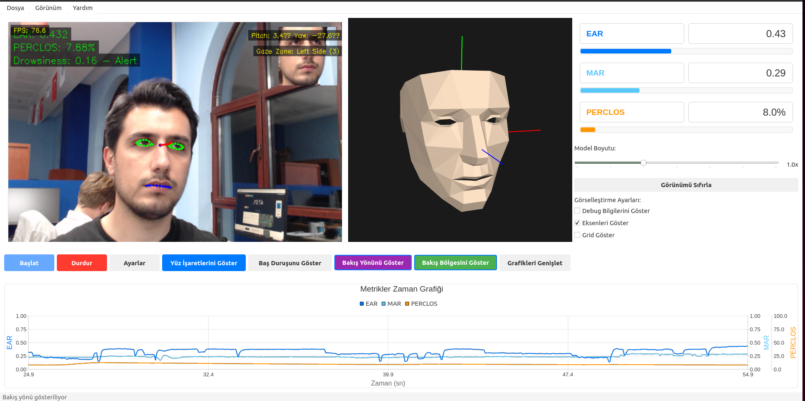
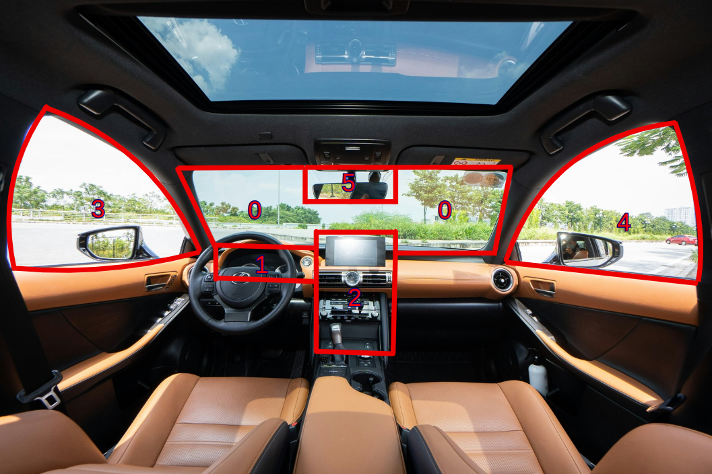
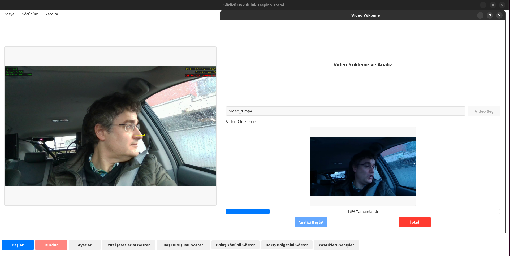
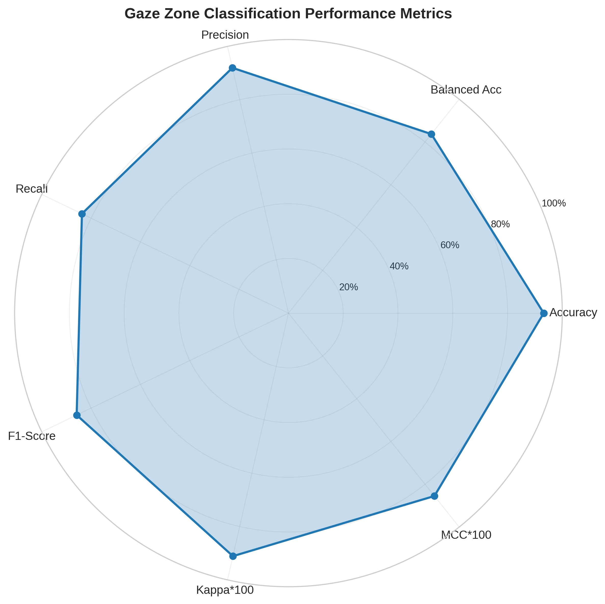

# Real Time Driver Drowsiness and Distraction Detection System

[](https://python.org)
[](https://riverbankcomputing.com/software/pyqt/)
[](https://mediapipe.dev/)
[](LICENSE)






---

## Installation

### 1. Installing Required Packages

```bash
# Clone the repository
git clone https://github.com/username/driver-drowsiness.git
cd driver-drowsiness

# Create a virtual environment (recommended)
python -m venv venv

# Activate the virtual environment
# Windows:
venv\Scripts\activate
# macOS/Linux:
source venv/bin/activate

# Install required packages
pip install -r requirements.txt
```

### 2. Downloading the ETH-XGaze Model

The ETH-XGaze model is not included in the repository due to its large size. Follow these steps:

#### **Option A: Official Model (Recommended)**
1. Visit the [ETH-XGaze official page](https://ait.ethz.ch/projects/2020/ETH-XGaze/)
2. Download the model file (`epoch_24_ckpt.pth.tar`)
3. Place it in the `models/` directory:
   ```bash
   mkdir -p models
   # Copy the downloaded file to the models directory
   cp /download/path/epoch_24_ckpt.pth.tar models/eth_xgaze_model.pth
   ```

#### **Option B: ONNX Format (Fast Inference)**
```bash
# Run the model conversion script
python scripts/convert_ethxgaze_model.py models/eth_xgaze_model.pth models/eth_xgaze_model.onnx --export_onnx
```

---

## Usage

### 1. Basic Usage

```bash
# Start the main application
python run.py
```

**Usage Steps:**
1. Make sure your camera is connected
2. Click the **"Start"** button
3. Keep your face in the camera's field of view
4. Monitor real-time metrics
5. End the analysis with **"Stop"**


### 2. Video Analysis

```bash
# Video file analysis
python examples/analyze_video.py --input video.mp4 --output results/

# Batch video analysis
python scripts/batch_analyze.py --input_dir videos/ --output_dir results/
```

You can use the feature either command line or application.


### 3. Gaze Zone Detection

```bash
# Gaze zone test
python tests/test_gaze_zone_detector.py --camera 0 --show_zones

# Gaze zone calibration
python scripts/calibrate_gaze_zones.py
```

EU regulation C(2023)4523 compliant zones:

| Zone ID | Zone Name | Area | Criticality |
|---------|-----------|------|-----------|
| 0 | Road Center | Area 2 | 🔴 Critical |
| 1 | Driving Instruments | Area 2 | 🟡 Driving Related |
| 2 | Infotainment | Area 1 | 🟠 Non-Driving |
| 3 | Left Side | Area 2 | 🟡 Driving Related |
| 4 | Right Side | Area 2 | 🟡 Driving Related |
| 5 | Rear Mirror | Area 2 | 🔴 Critical |



#### Classification Performance Metrics
- Overall Accuracy: 93.23%
- Balanced Accuracy: 83.70%
- Macro-averaged Precision: 91.96%
- Macro-averaged Recall: 83.70%
- Macro-averaged F1-Score: 85.84%

#### Statistical Reliability Measures
- Cohen's Kappa: 0.9110 (Almost Perfect)
- Matthews Correlation Coefficient: 0.8549
- Krippendorff's Alpha: 0.9110

---

## Metrics

### **EAR (Eye Aspect Ratio)**
- **Formula**: `EAR = (|p2-p6| + |p3-p5|) / (2 * |p1-p4|)`
- **Threshold Value**: 0.21 (eyes considered closed below this)
- **Usage**: Instant eye blink and closure detection

### **MAR (Mouth Aspect Ratio)**
- **Formula**: `MAR = |p14-p18| / |p12-p16|`
- **Threshold Value**: 0.65 (mouth considered open above this)
- **Usage**: Yawning detection

### **PERCLOS**
- **Definition**: Percentage of eye closure over a 60-second period
- **Warning Threshold**: 15%
- **Critical Threshold**: 20%

### **KSS (Karolinska Sleepiness Scale)**
| Score | Status | Description |
|------|-------|----------|
| 1-3 | 🟢 Normal | Fully awake state |
| 4-5 | 🟡 Mild | Mild signs of fatigue |
| 6-7 | 🟠 Warning | Beginning of attention deficit |
| 8-9 | 🔴 Critical | Immediate intervention required |

---

## **Scientific References**
- **ETH-XGaze**: Gaze estimation model ([Paper](https://arxiv.org/abs/2007.15837))
- **MediaPipe**: Face mesh detection ([Documentation](https://google.github.io/mediapipe/))
